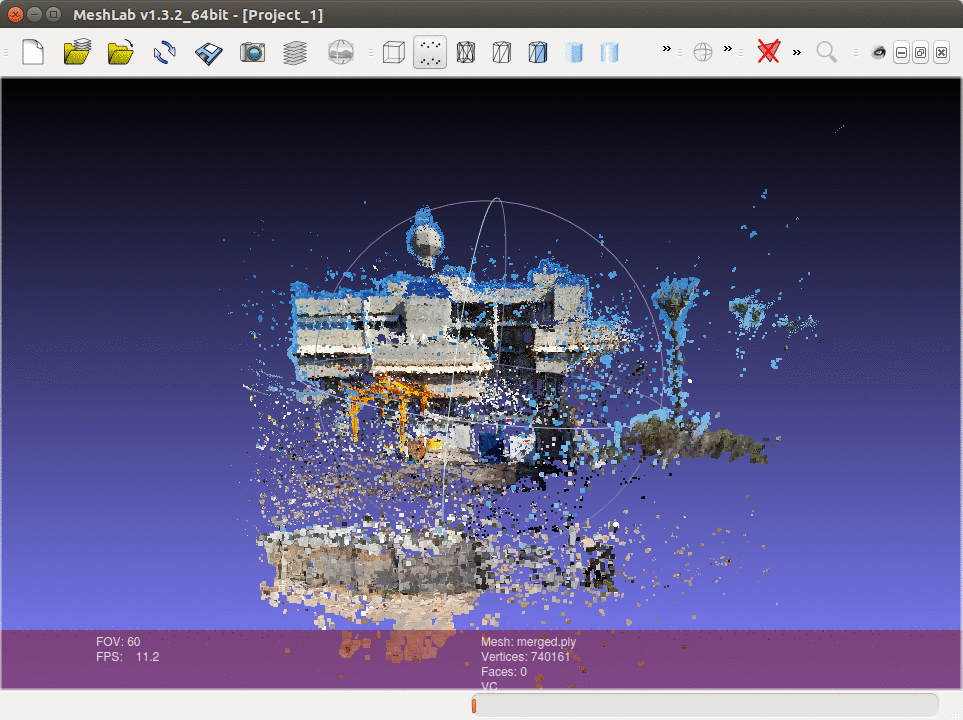
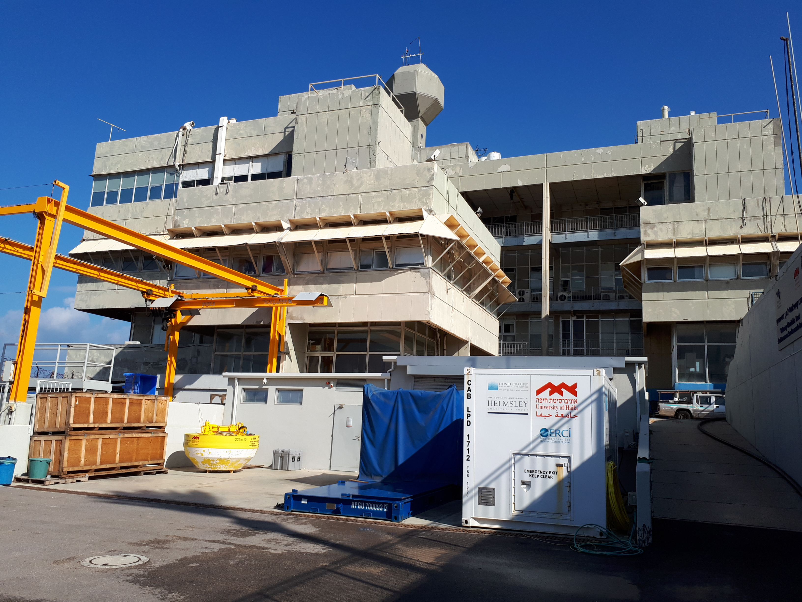
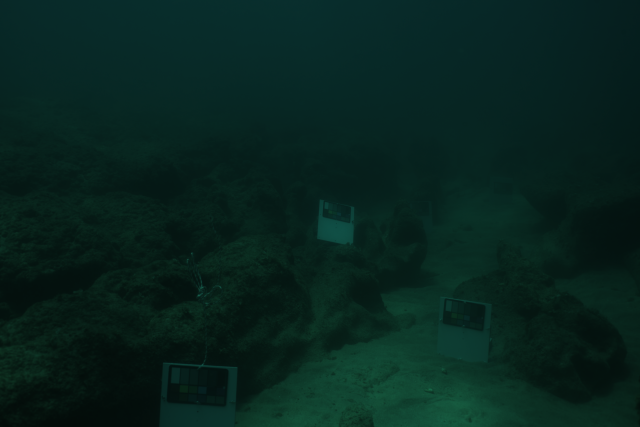

# Underwater Computer Vision and Image Processing Course
These are homeworks from Underwater Computer Vision and Image Processing Course (taught by Dr. Tali Treibitz)
at the University of Haifa.
The homeworks were solved entirely by myself.

## [HW 1](hw1)
Here, the tasks were to calibrate a camera and thereafter to do structure from motion (SfM).
I used [OpenSfm](https://github.com/mapillary/OpenSfM).

## [HW 2](hw2)
Here a depthmap was reconstructed and used to simulate an underwater model.

## [HW 3](hw3)
Here image recovery algorithms were implemented.
|Before|After|
|------|-----|
|||
