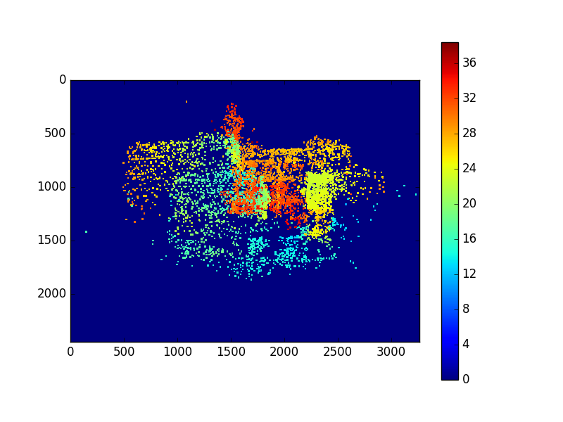
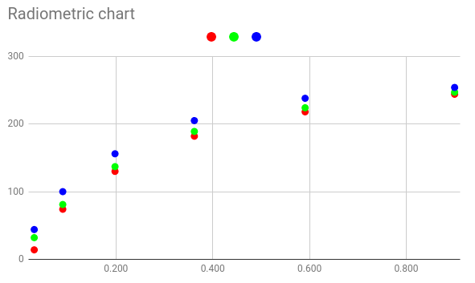

# Principles in UW Imaging - HW 1
## Part 1 - Intrinsic calibration:
###a. Calibrate camera intrinsic params:
The code for this is located in `camera_calibration.py`

Checkerboard photos are located in folder `checkerboard`.

The code basically takes the images in the checkerboard folder and looks for a
checkerboard pattern. Points are saved and and plugged into the camera calibration
function. The code was adapted from the openCV tutorial.

In the end the output for the calibration matrix was the following:
```
[[  2.61467996e+03,   0.00000000e+00,   1.63233533e+03],
 [  0.00000000e+00,   2.62631303e+03,   1.22899719e+03],
 [  0.00000000e+00,   0.00000000e+00,   1.00000000e+00]]
```
Distortion Coefficients are `(k1,k2,p1,p2,k3)` :
```
[[  3.19950693e-01,  -1.55843810e+00,   6.83257624e-04,  5.97069049e-04,   2.33263373e+00]]
```
###b. Object coordinates
Code was written calculate the projection of object at point `(1,1,1)` and then
at point `(1,1,10)`.

The code for the calculation is in `project_to_2d.py`. In the code we first take
the x and y coordinates and divide each of them by z. Next, we distort the image using
the barrel and pincusion distortion models and the coefficients found earlier.
After that the calibration matrix is multiplied by distorted x,y and z=1.
The coordinates found were the following:
```
('2d projection of coordinate 1 %:\n', (1, 1, 1))
[[-10369.29727719]
 [-10825.57961319]]
('2d projection of coordinate 2 %:\n', (10, 1, 1))
[[ -4.14798850e+08]
 [ -4.16632043e+07]]
('2d projection of coordinate 3 %:\n', (1, 1, 10))
[[ 1895.41164364]
 [ 1493.24849525]]
 ```
The first and second calculations will be out of the frame of the camera. The third
will be in the frame.

## Part II - SfM
###a. Taking the photos
20 photos were taken using a cellphone camera (Samsung Galaxy A7 2017) from different angles.

###b. SfM
For this part I used [OpenSfm](https://github.com/mapillary/OpenSfM). Open SfM takes in
images from the and processes them for SfM. 


###c and d - generate distance map
OpenSfM generates depthmaps and stores them as .npz files. The files were opened in python
and the depthmap found and plotted. Values for the colorbar are in meters.


Since we were asked to create a depthmap from a point cloud I created the `compute_depthmap.py`
script. The script does the following:
* loads the `undistorted_reconstruction.json` file created by OpenSfM
* The point cloud data is then extracted along with camera data for the specific shot.
* The rotation/translation (Rt) matrix is then built.
* The Rt matrix is then multiplied by each point in the point cloud. Now the Point Cloud is relative to
the camera.
* The resulting points are then sent to the `project_to_2d.py` function that was built in part 1.
Distances from points to camera are also calculated.
Now we have the points on the camera plane and their distances.
* Lastly, we plot the image.



## Part III - Radiometry
Here the photo was taken of the xrite colour chart and each grey square was sampled:

The following is a table with the reflectance of the chart and underneath the html
colour values: 

|Irrandiance|0.031	|0.090	|0.198	|0.362	|0.591	|0.900  |
|-----------|-------|-------|-------|-------|-------|-------|
|html value|0e202c	|4a5164	|82899c	|b6bdcd	|dae0ee	|f4f7fe |

Individual colour values are extracted from the html values.

The radiometric chart is plotted thus:


