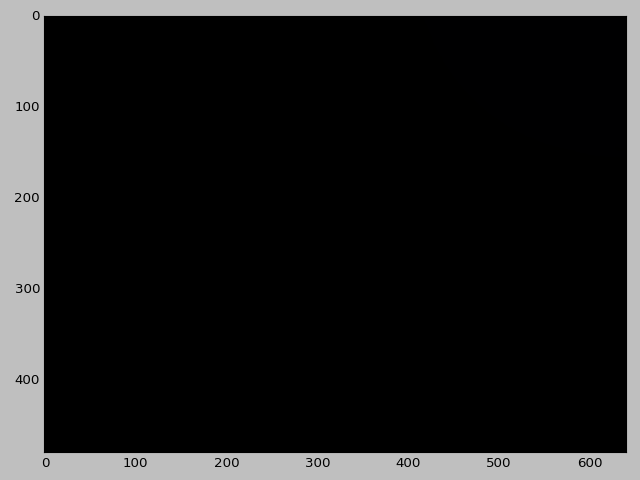
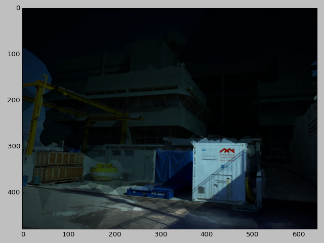
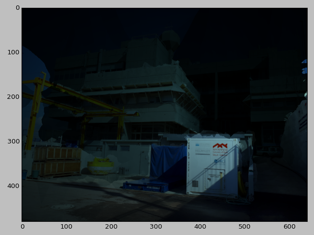
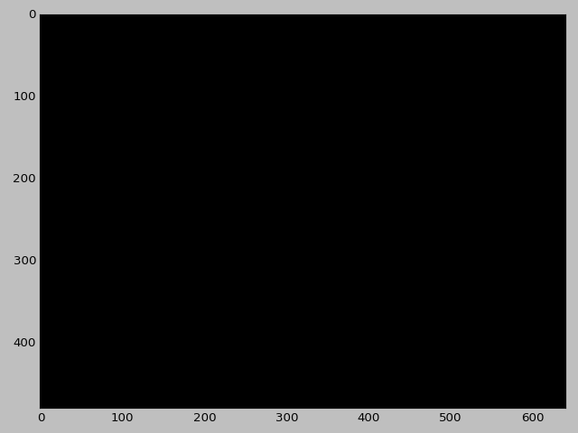
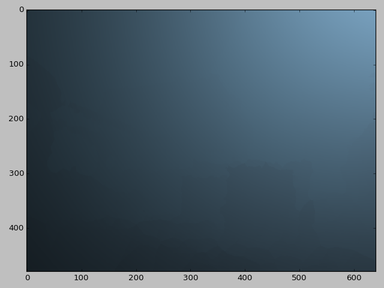
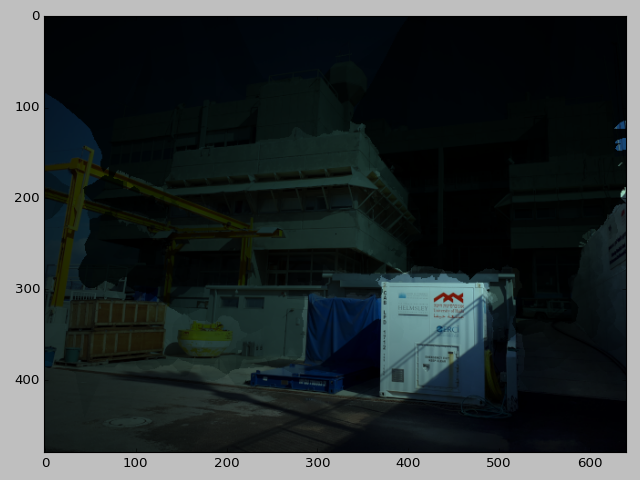
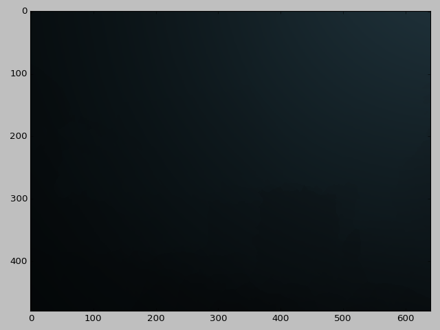
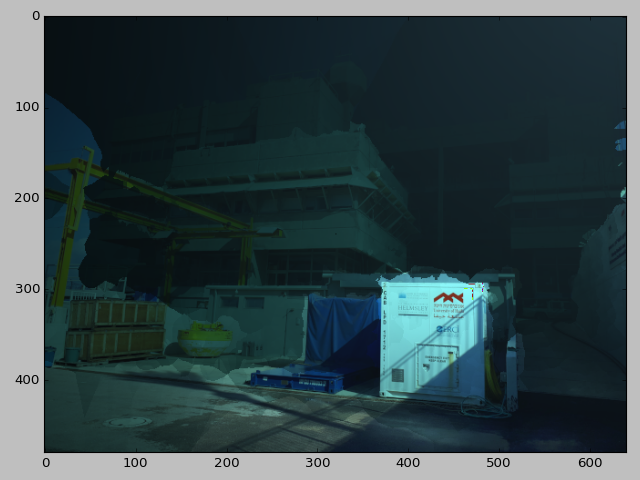

# UW Image Processing HW2

## Exercise 1 - Readying the Data

Here we're asked to calculate the world coordinates from a distatnce map.
This can either be done with a scene and distance map from hw1 or from
[an existing dataset](http://vision.middlebury.edu/stereo/data/). I chose
to use a scene and depthmap from hw1.

### 1.a. Prepare the depthmap
I'll be using the following scene:


The depthmap was obtained using openSfM in hw1:


It can be seen that the depthmap is noisy with speckled nois and also
that there are a lot of blank spaces with no info (the deep blue).
To remove the speckled noise I used a mean filter of kernel size 7.
the depthmap size is 604x480px.


The depthmap was interpolated:


Then finally the depthmap is upscaled to the original image size of
3264x2448px.

### 1.b. Find the points 3D coordinates
Now we'll look for the 3D coordinates corresponding to each pixel whilest
relying on the depthmap from 1.a and the camera matrix from the previous
hw to preform the calculation. We'll take the pinhole camera model
([equation from opencv webstite](https://docs.opencv.org/2.4/modules/calib3d/doc/camera_calibration_and_3d_reconstruction.html)):


and solve for x and y using the following code:
```python
world_coordinates[u][v] = np.transpose(np.linalg.inv(calibration_matrix) * np.transpose(np.matrix([u,v,1]))* z)
```

We assume that the camera is in (0,0,0) in world coordinates with rotation
of 0. From hw1 the callibration matrix:
```
[[  2.61467996e+03,   0.00000000e+00,   1.63233533e+03],
 [  0.00000000e+00,   2.62631303e+03,   1.22899719e+03],
 [  0.00000000e+00,   0.00000000e+00,   1.00000000e+00]]
```

To speed up the image processing we'll use 640x480 images instead of the original 3264x2448.
Thus, all the callibration matrix coefficients (except z) shall be divided by 5.1. Also, to
achieve better results the resulting map was scaled down by a factor of 5.
 

## Exercise 2 - Building and Simulating the underwater model

We'll start by taking the original image and normalising so that the maximum of each channel
shall be 0.2. We do that by dividing each channel by 255 and multiplying by 0.2. We get the following image:


### Computation of I_d

The I_d was computed using the [referenced paper](http://csms.haifa.ac.il/profiles/tTreibitz/webfiles/Spier_et_al_2017_insitu-targetless.pdf).
It's implemented in `compute_I_d` in [uw_strobe_sim](uw_strobe_sim/strobe_sim.py).
The implementation is using vector implementation and all colour channels are computed
using the same vector.

###  Computation of Backscatter

Backscatter for each point on the image was computed by integrating the backscatter of each point
along the ray from the camera to the point in space. To compute the backscatter of a point on a
ray the `B_point` function was implemented. This function is in turn integrated inside the
`compute_backscatter` function. The `compute_backscatter` function computes a single colour channel.
The channels are then collated.

|water type and strobe distance|  reflected light| backscatter| I_t|
|----------|----------------|------------|----|
|J1 10 cm||||
|J1 50cm||||
|J1c 10 cm||||
|J1c 50cm||||

