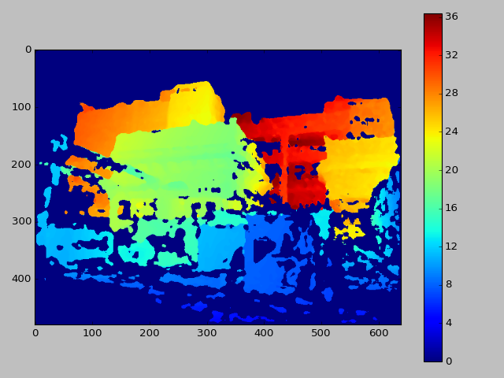

# UW Image Processing HW2

## Exercise 1 - Readying the Data

Here we're asked to calculate the world coordinates from a distatnce map.
This can either be done with a scene and distance map from hw1 or from
[an existing dataset](http://vision.middlebury.edu/stereo/data/). I chose
to use a scene and depthmap from hw1.

### 1.a. Prepare the depthmap
I'll be using the following scene:

The depthmap was obtained using openSfM in hw1:

It can be seen that the depthmap is noisy with speckled nois and also
that there are a lot of blank spaces with no info (the deep blue).
To remove the speckled noise I used a mean filter of kernel size 7.
the depthmap size is 604x480px.

The depthmap was interpolated:

Then finally the depthmap is upscaled to the original image size of
3264x2448px.

### 1.b. Find the points 3D coordinates
Now we'll look for the 3D coordinates corresponding to each pixel whilest
relying on the depthmap from 1.a and the camera matrix from the previous
hw to preform the calculation. We'll take the pinhole camera model
([equation from opencv webstite](https://docs.opencv.org/2.4/modules/calib3d/doc/camera_calibration_and_3d_reconstruction.html)):

and solve for x and y and we get the following equations:

We assume that the camera is in (0,0,0) in world coordinates with rotation
of 0.
