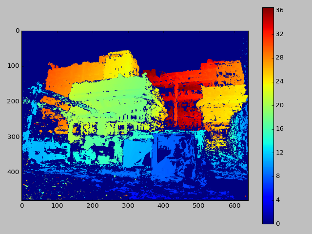

# UW Image Processing HW2

## Exercise 1 - Readying the Data

Here we're asked to calculate the world coordinates from a distatnce map.
This can either be done with a scene and distance map from hw1 or from
[an existing dataset](http://vision.middlebury.edu/stereo/data/). I chose
to use a scene and depthmap from hw1.

I'll be using the following scene:

The depthmap was obtained using openSfM in hw1:

It can be seen that the depthmap is noisy with speckled nois and also
that there are a lot of blank spaces with no info (the deep blue).
To remove the speckled noise I used a mean filter of kernel size 7.
the depthmap size is 604x480px.

Finally the depthmap was interpolated:

