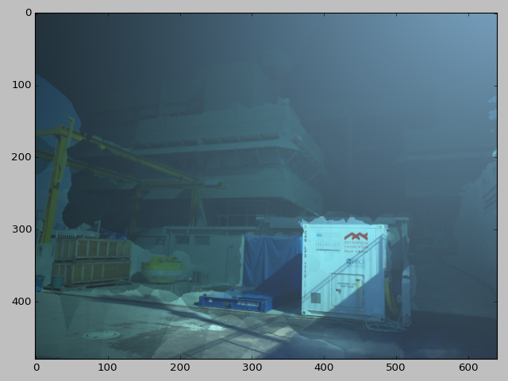

# UW Image Processing HW2

## Exercise 1 - Readying the Data

Here we're asked to calculate the world coordinates from a distatnce map.
This can either be done with a scene and distance map from hw1 or from
[an existing dataset](http://vision.middlebury.edu/stereo/data/). I chose
to use a scene and depthmap from hw1.

### 1.a. Prepare the depthmap
I'll be using the following scene:


The depthmap was obtained using openSfM in hw1:


It can be seen that the depthmap is noisy with speckled noise and also
that there are a lot of blank spaces with no info (the deep blue). The
colorbar on the side is in meters.
To remove the speckled noise I used a mean filter of kernel size 7.
the depthmap size is 640x480px.


The depthmap was interpolated:


### 1.b. Find the points 3D coordinates
Now we'll look for the 3D coordinates corresponding to each pixel whilest
relying on the depthmap from 1.a and the camera matrix from the previous
hw to preform the calculation. We'll take the pinhole camera model
([equation from opencv webstite](https://docs.opencv.org/2.4/modules/calib3d/doc/camera_calibration_and_3d_reconstruction.html)):


If I'm to take the last 2 equations and multiply by z I'll get:


and solve for x,y,z:


and in the code:

```python
world_coordinates[u][v] = np.transpose(np.linalg.inv(calibration_matrix) * np.transpose(np.matrix([u,v,1]))* z)
```
The result is a 3d matrix where 2 axes are the size of the image and the 3rd axis is the
coordinate vector of the object in 3d space.

We assume that the camera is in (0,0,0) in world coordinates with rotation
of 0. From hw1 the callibration matrix:
```
[[  2.61467996e+03,   0.00000000e+00,   1.63233533e+03],
 [  0.00000000e+00,   2.62631303e+03,   1.22899719e+03],
 [  0.00000000e+00,   0.00000000e+00,   1.00000000e+00]]
```

To speed up the image processing we'll use 640x480 images instead of the original 3264x2448.
Thus, all the callibration matrix coefficients (except z) shall be divided by 5.1. Also, to
achieve better results the distances in the resulting map was scaled down by a factor
of 5, (e.g a distance of 10m is now 2m).
 

## Exercise 2 - Building and Simulating the underwater model

We'll start by taking the original image and normalising so that the maximum of each channel
shall be 0.2. We do that by dividing each channel by 255 and multiplying by 0.2. We get the following image:


The water types used were J1 and J1c. For J1 the following values were used:

|variable|Red|Green|Blue|
|--------|---|-----|----|
|c |0.228|0.046|0.019|
|beta_hg|1.22e-3| 2.05e-3| 3.06e-3|

For water type J1c:

|variable|Red|Green|Blue|
|--------|---|-----|----|
|c |0.236| 0.068| 0.077|
|beta_hg|0.314| 0.395| 0.469|

### Computation of I_d

The I_d was computed using the [referenced paper](http://csms.haifa.ac.il/profiles/tTreibitz/webfiles/Spier_et_al_2017_insitu-targetless.pdf).
It's implemented in `compute_I_d` in [uw_strobe_sim](uw_img_sim/strobe_sim.py).
The implementation is using vector implementation and all colour channels are computed
using the same vector.

###  Computation of Backscatter

Backscatter for each point on the image was computed by integrating the backscatter of each point
along the ray from the camera to the point in space. To compute the backscatter of a point on a
ray the `B_point` function was implemented. This function is in turn integrated inside the
`compute_backscatter` function. The `compute_backscatter` function computes a single colour channel.
The channels are then collated.

Note: To calculate the phi in the model I assumed that the normal of all points point
 in the -z direction

### Results

Here the computed models are shown. Strobe distance of 10cm and 50cm means that the
strobe is located at (10,10,0)cm and (50, 50, 0)cm respectively.

|water type and strobe distance|  reflected light| backscatter| I_t|
|----------|----------------|------------|----|
|J1 10 cm||||
|J1 50cm||||
|J1c 10 cm||||
|J1c 50cm||||

## Conclusion

Four simulations were done in total, the simulations produced using an existing image
with depth of field information.
The model works as expected, producing rather realistic results.

The different water types affected colour transmission and backscatter, as expected.
With the J1 water type having almost no backscatter, which is in line with the
beta_hg numbers given to it. Also we can see colour differences in the different
water types which is in line with the different transmission loss coefficients.

Regarding the strobe position there are a number of things to take note of.
First, we can see that when the strobe is placed farther away
we get much less backscatter. This is due to an decrease in the angle of phi , i.e.
the angle between the ray from the strobe to object and object to camera.
Second, a greater strobe intensity could be used for the farther strobe setup,
around one and a half times greater than the closer setup. This lead to greater
illumination of the objects farther from the camera.
Third, it can be seen that the floor in th forground is more lit when the strobe is positioned
closer to the camera. This may be due to the fact that I assumed that the image plane
is in the z direction for the whole scene. If a real plane were to be used the phi
angle would increase and the floor would be dimmer.

There are a number of improvements that can be done to improve the simulation quality,
most notably, aquiring a better depthmap. The depthmap that I aquired was relatively
sparse and had no usable information in the forground(where the floor is located).
Another feature to implement would be to accurately compute the plane surfaces so as
to get an accurate angle phi.

Regarding code runtime, the computation of backscatter was very slow. This is due to
the fact that the integration done was very accurate and also a for loop was
implemented to compute each pixel in the backscatter. It took between minutes to tens
of minutes to compute each 640x480 image.
There can be faster ways compute for example:
* Instead of a for loop implement a vectorised operation.
* Implement the integration function as a ctype.