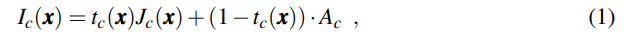
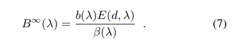
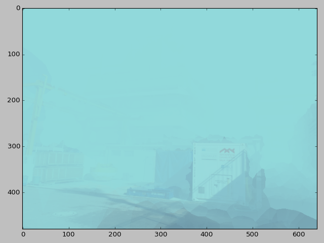
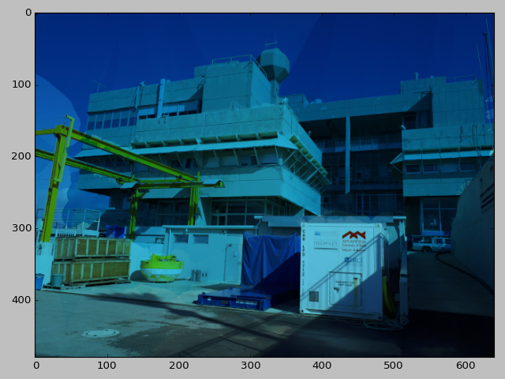

# UW Image Processing HW3

##Exercise 1 - Simulate Ambient Lighting
For this exercise I chose to use the image and distance map that I used in the [previous homework](../hw2/README.md). Also, I used the Jarlov water types from the previous homework. To make code reuse easier, I put the code in the `hw2` folder under
[ambient_sim](../hw2/uw_img_sim/ambient_sim.py). For this exercise the `simulate_ambient` function was created.

For implementation of the simulation equation 1 from
[Berman's paper](https://www.eng.tau.ac.il/~berman/UnderwaterColorRestoration/UnderwaterHazeLines_BMVC2017.pdf) was used.
 
 
 To calculate the veiling light, equation 7 from
[Akkaynak's paper](http://csms.haifa.ac.il/profiles/tTreibitz/webfiles/revised-underwater-image.pdf) was used.

The water types used were J1 and J1c. For J1 the following values were used:

|variable|Red|Green|Blue|
|--------|---|-----|----|
|a |0.228|0.046|0.019|
|b|1.22e-3| 2.05e-3| 3.06e-3|

For water type J1c:

|variable|Red|Green|Blue|
|--------|---|-----|----|
|a |0.236| 0.068| 0.077|
|b|0.314| 0.395| 0.469|

Where a is the absorbtion and b is the backscatter coeeficient.

The actual distances obtained from the depthfile were halved, otherwise the image in watertype J1c would be unusable. Here are the results of the simulation:

### J1c

### JI

The results are consistant with the water types. JI has almost no backscatter, hence we see a clear image with mostly attenuation. J1c on the other hand has a lot more  backscatter, hence the image degrades more with the distance.

