# UW Image Processing HW3

##Exercise 1 - Simulate Ambient Lighting
For this exercise I chose to use the image and distance map that I used in the [previous homework](../hw2/README.md). Also, I used the Jarlov water types from the previous homework. To make code reuse easier, I put the code in the `hw2` folder under
[ambient_sim](../hw2/uw_img_sim/ambient_sim.py). For this exercise the `simulate_ambient` function was created.

For implementation of the simulation equation 1 from
[Berman's paper](https://www.eng.tau.ac.il/~berman/UnderwaterColorRestoration/UnderwaterHazeLines_BMVC2017.pdf) was used.
 
 
 To calculate the veiling light, equation 7 from
[Akkaynak's paper](http://csms.haifa.ac.il/profiles/tTreibitz/webfiles/revised-underwater-image.pdf) was used.

The water types used were J1 and J1c. For J1 the following values were used:

|variable|Red|Green|Blue|
|--------|---|-----|----|
|a |0.228|0.046|0.019|
|b|1.22e-3| 2.05e-3| 3.06e-3|

For water type J1c:

|variable|Red|Green|Blue|
|--------|---|-----|----|
|a |0.236| 0.068| 0.077|
|b|0.314| 0.395| 0.469|

Where a is the absorbtion and b is the backscatter coeeficient.

The actual distances obtained from the depthfile were halved, otherwise the image in watertype J1c would be unusable. Here are the results of the simulation:

### J1c

### JI

The results are consistant with the water types. JI has almost no backscatter, hence we see a clear image with mostly attenuation. J1c on the other hand has a lot more  backscatter, hence the image degrades more with the distance.

## Exercise 2 - Scene Reconstruction

Reconstruction was done using an adaption of the algorithm in Roser et al. 2014. The paper uses a trust region approach on equations 6 and 7. Since we haven't learnt this optimisation method in class I will try doing a curve fitting approach on equation 6.
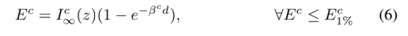

The results using the 1st percentile were not good so I used a minimum rolling window of size 10k. This results in a good curve for the J1c:

|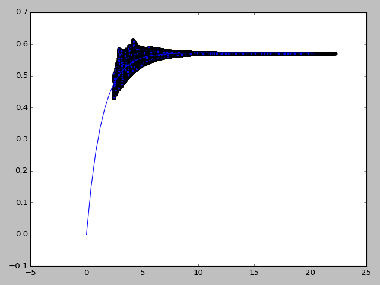|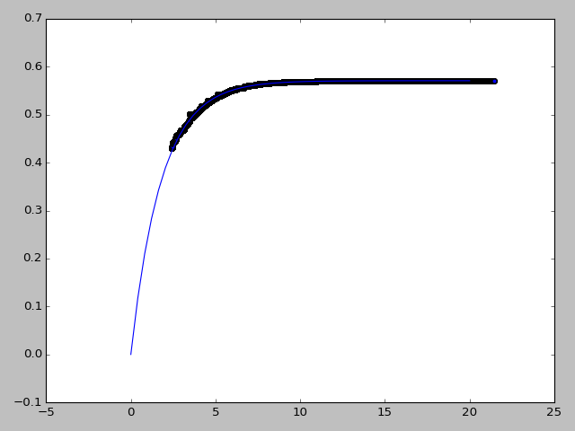|
|-----------|----------|
|J1c_before curve percentile window | J1c_after percentile window|

Where the x axis is distance and y axis is intensity.

The images were reconstructed using equation 8:

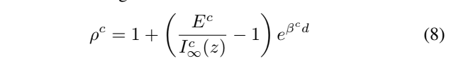

Where rho is the normalised radiance. I multiplied that number by the airlight value obtained from the curve fit (I_inf). The values that were obtained were clipped to a range between 0 and 1.
The results are good in both JI and J1c water reconstruction simulations:

|Water Type|Before|After|
|----------|------|-----|
|J1c||  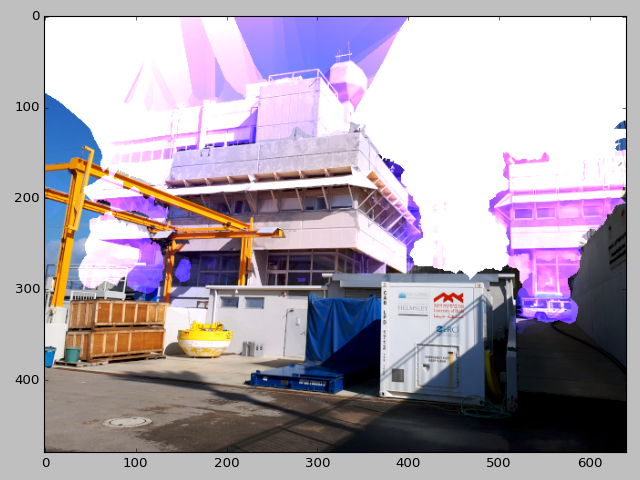|
|JI||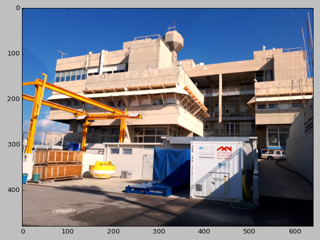|

I will now present the accuracy of the parameters. For JI:

|variable|Red|Green|Blue|
|--------|---|-----|----|
|Airlight true|0.0053224|0.04266389| 0.1387126|
|Airlight estimate|0.0054676 | 0.04172887| 0.12825527|
|Airlight error %| 2.73| -2.19| -7.54|
|beta true|0.22922| 0.04805| 0.02206|
|beta estimate|0.24840542| 0.05619931| 0.02548734|
|beta error %|-8.37| -16.96| -15.54|

For J1c:

variable|Red|Green|Blue|
|--------|---|-----|----|
|Airlight true|0.57090909| 0.85313175| 0.85897436|
|Airlight estimate|0.57071875| 0.85278465| 0.8582655|
|Airlight error %| -0.0333| -0.0407| -0.0825|
|beta true|0.55 | 0.463| 0.546|
|beta estimate|0.55760176| 0.46878319| 0.56018567|
|beta error %|-1.382| -1.249| -2.598|

Notice that the estimates are much better for the J1c water, this is due to the attenuation being more significant in this water, thus the curve we are looking for is more pronounced.

The accuracy for estimating the scene looks good on the whole. Though there is some noticable clipping of values in both water types, much more detail can be seen in the in the J1c scene after reconstruction.

## Exercise 3 - Real World results

The real world results are not as good as the simulation:

|Image No.|Before|After|
|----------|------|-----|
|3266|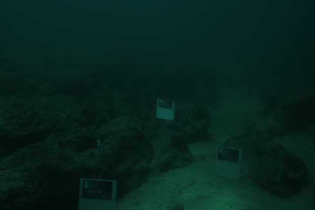|  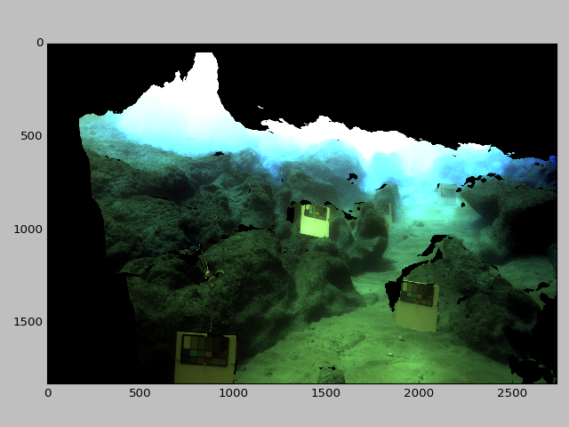|
|4027|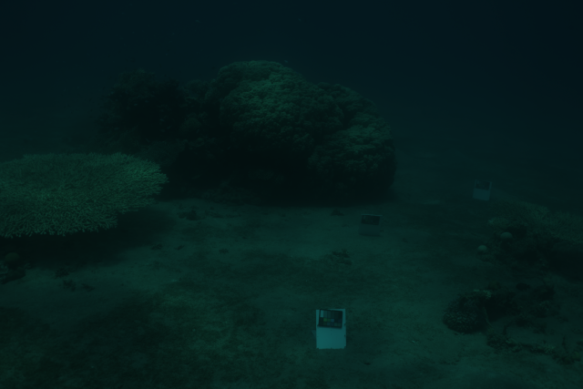|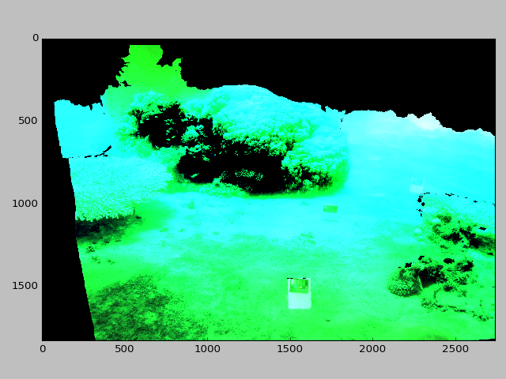|

There is noticable clipping in both images, with significant clipping  in 4027. An explaination for this would be the curve fit didn't work well in image 4027 as can be seen in the green and blue channels be seen in below in the distance/intensity plot for green channel:
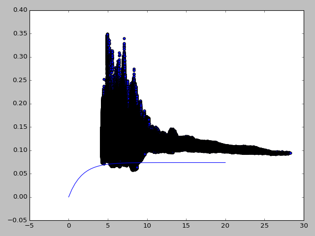
this causes the blue and especially the blue channels to oversaturate. It can also be seen in the graph that the lowest intensity data points don't exactly conform to a curve and thus it is difficult to fit a curve to the data.

